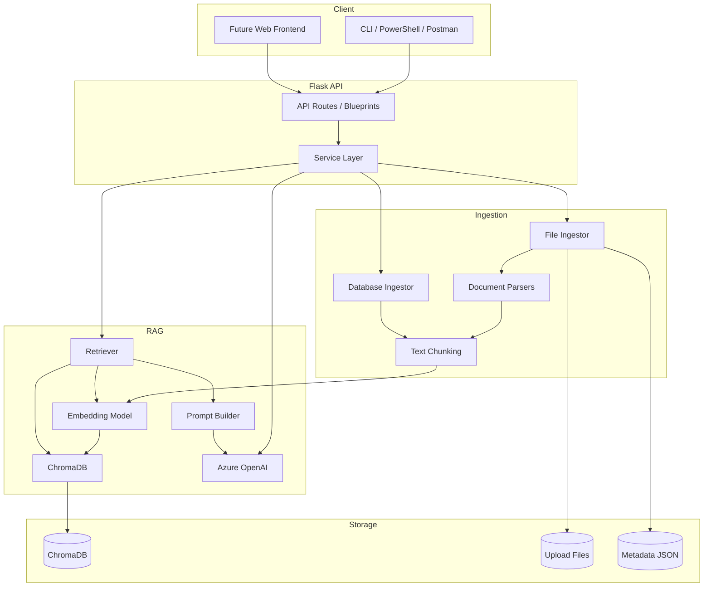
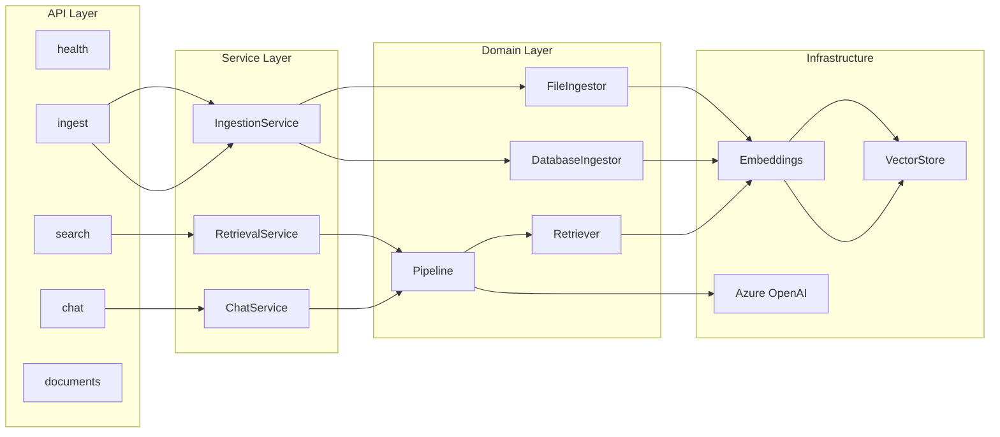
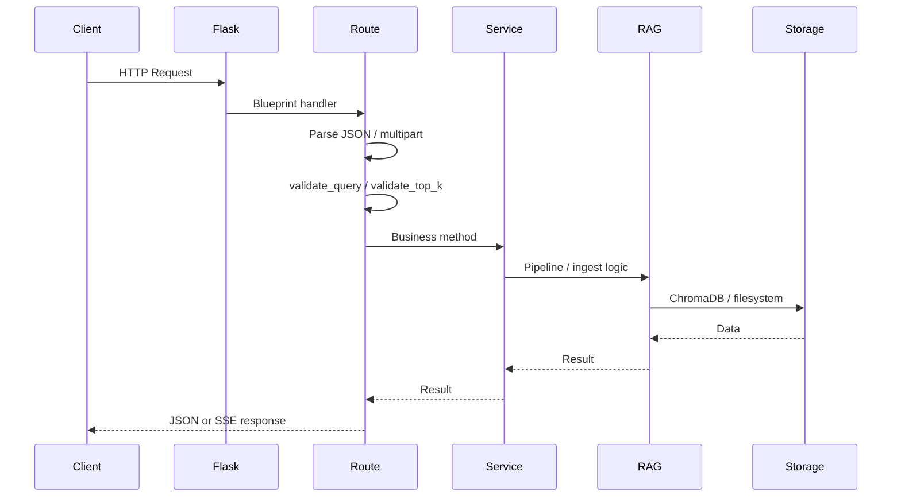
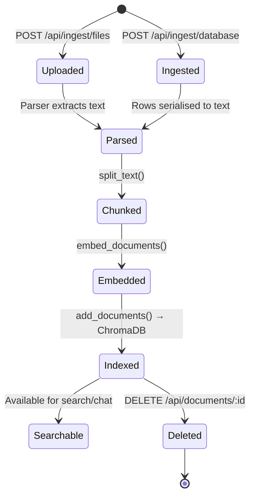
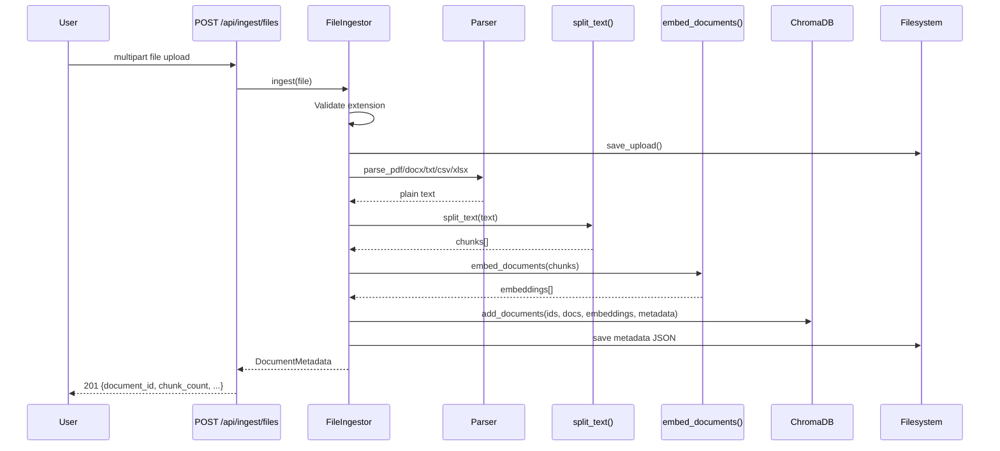
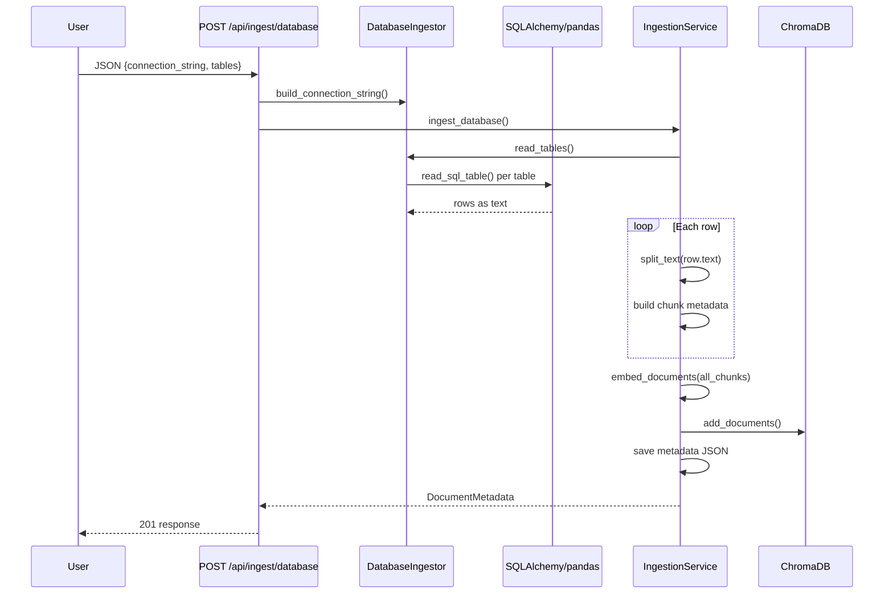
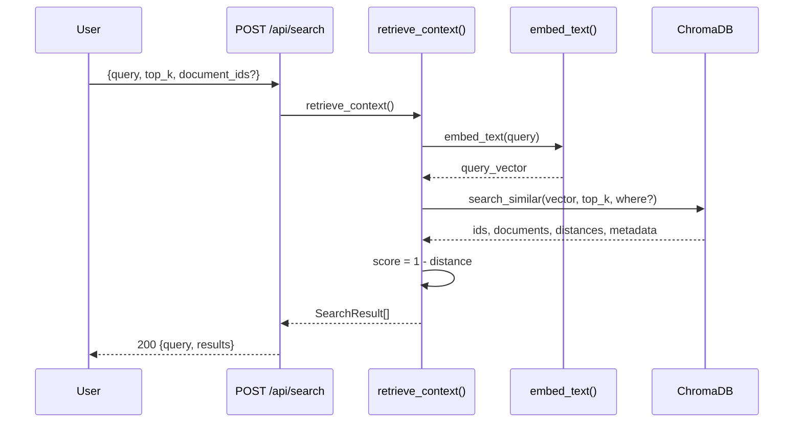
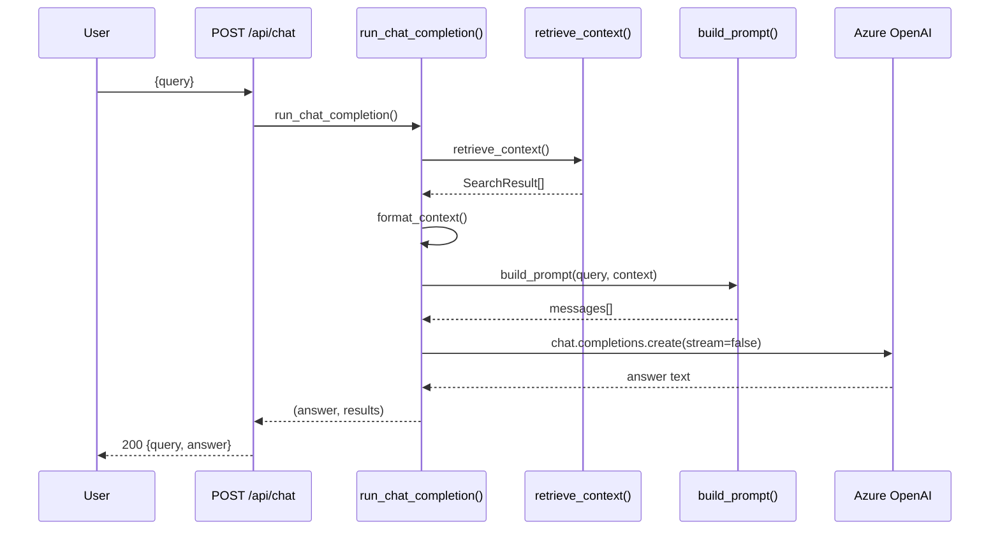
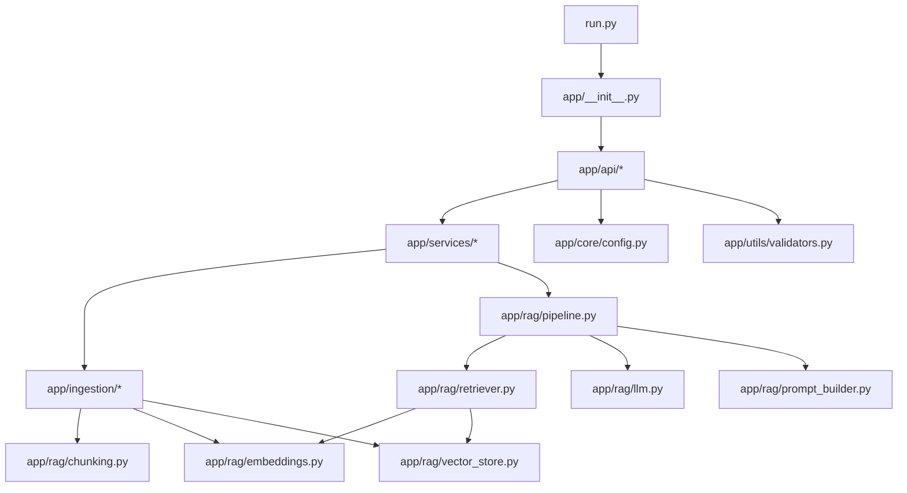

# RAG System — Technical Documentation

**Version:** 1.0  
**Last updated:** May 2026  
**Repository path:** `rag-system/`

---

## Table of Contents

1. [Project Overview](#1-project-overview)
2. [Technology Stack](#2-technology-stack)
3. [Project Structure](#3-project-structure)
4. [Application Architecture](#4-application-architecture)
5. [API Documentation](#5-api-documentation)
6. [Core Business Logic](#6-core-business-logic)
7. [Database & Storage Documentation](#7-database--storage-documentation)
8. [Authentication & Security](#8-authentication--security)
9. [Frontend Documentation](#9-frontend-documentation)
10. [Backend Documentation](#10-backend-documentation)
11. [Third-Party Integrations](#11-third-party-integrations)
12. [Environment & Configuration](#12-environment--configuration)
13. [Setup & Running the Project](#13-setup--running-the-project)
14. [Testing](#14-testing)
15. [Error Handling & Logging](#15-error-handling--logging)
16. [Performance & Scalability](#16-performance--scalability)
17. [Important Workflows](#17-important-workflows)
18. [Developer Notes](#18-developer-notes)
19. [Code Examples](#19-code-examples)
20. [Appendix](#20-appendix)

---

## 1. Project Overview

### 1.1 What the Application Does

The **RAG System** is a **Retrieval-Augmented Generation (RAG)** backend API built with Flask. It enables organisations to:

1. **Ingest** knowledge from files (PDF, DOCX, TXT, CSV, XLSX) and relational databases (PostgreSQL, MySQL, MSSQL, SQLite).
2. **Index** that content as semantic vector embeddings stored in ChromaDB.
3. **Retrieve** the most relevant text chunks for a user query using similarity search.
4. **Generate** grounded answers using Azure OpenAI, constrained to retrieved context.

The system is **API-only** — there is no bundled web frontend. Clients interact via HTTP (REST + SSE).

### 1.2 Purpose of the System

Traditional LLMs answer from pre-trained knowledge and may hallucinate on domain-specific questions. This system solves that by:

- Grounding every chat response in **organisation-specific documents**.
- Providing a **search endpoint** for direct semantic retrieval without LLM cost.
- Separating **ingestion**, **retrieval**, **embedding**, and **generation** into independent, replaceable modules.

### 1.3 Business / Domain Problem

Enterprises accumulate knowledge in PDFs, Word documents, spreadsheets, and operational databases. Employees need fast, accurate answers without manually searching multiple sources.

Example use cases:

- Policy and compliance Q&A over uploaded PDFs.
- Internal documentation search.
- Querying structured database records in natural language (after ingestion).

### 1.4 Main Features and Capabilities

| Feature | Description |
|---------|-------------|
| File ingestion | Upload and parse PDF, DOCX, TXT, CSV, XLSX |
| Database ingestion | Connect via SQLAlchemy and ingest table rows as text documents |
| Semantic search | Top-k similarity search over embedded chunks |
| RAG chat (JSON) | Full answer in one JSON response (`POST /api/chat`) |
| RAG chat (SSE) | Token-by-token streaming (`POST /api/chat/stream`) |
| Document management | List and delete ingested documents |
| Health check | Service status and chunk count |
| Persistent storage | Local ChromaDB, uploads, and metadata on disk |
| Docker deployment | Containerised deployment via Docker Compose |

### 1.5 High-Level Architecture



---

## 2. Technology Stack

### 2.1 Stack Summary

| Layer | Technology | Version (requirements) |
|-------|------------|------------------------|
| Language | Python | 3.11 (Dockerfile) |
| Web framework | Flask | latest in requirements.txt |
| CORS | flask-cors | latest |
| Vector database | ChromaDB | latest |
| Embeddings | sentence-transformers + PyTorch | `all-MiniLM-L6-v2` |
| LLM | Azure OpenAI | via `openai` SDK |
| File parsing | PyMuPDF, python-docx, pandas, openpyxl | — |
| DB access | SQLAlchemy + drivers | psycopg2, pymysql, pyodbc |
| Config | python-dotenv | — |
| Production server | gunicorn | listed but not used in Dockerfile CMD |
| Containerisation | Docker, Docker Compose | — |
| Testing | pytest | requirements-dev.txt |

### 2.2 Technology Roles and Integration

#### Flask
- **Why:** Lightweight, well-suited for microservice-style API backends.
- **Role:** HTTP routing, request parsing, JSON responses, SSE streaming.
- **Integration:** Application factory pattern in `app/__init__.py` registers blueprints for each domain.

#### ChromaDB
- **Why:** Embedded persistent vector store; no separate database server required for prototyping.
- **Role:** Stores document chunk embeddings and metadata; performs cosine similarity search.
- **Integration:** Accessed exclusively through `app/rag/vector_store.py`.

#### sentence-transformers (`all-MiniLM-L6-v2`)
- **Why:** Fast, local, open embedding model; no API cost for embedding.
- **Role:** Converts text chunks and queries into 384-dimensional vectors.
- **Integration:** Singleton model loaded lazily in `app/rag/embeddings.py`.

#### Azure OpenAI
- **Why:** Enterprise-grade hosted LLM with Azure security and compliance.
- **Role:** Generates natural-language answers from retrieved context.
- **Integration:** `app/rag/llm.py` via official `openai.AzureOpenAI` client.

#### SQLAlchemy + pandas
- **Why:** Database-agnostic connection and table reading.
- **Role:** Database ingestion reads tables and serialises rows to text.
- **Integration:** `app/ingestion/database_ingestor.py` with per-DB URL builders in `connectors/`.

#### PyMuPDF, python-docx, pandas
- **Why:** Industry-standard parsers for common document formats.
- **Role:** Extract plain text from uploaded files before chunking.
- **Integration:** Called from `app/ingestion/file_ingestor.py` via a parser registry.

#### Docker
- **Why:** Reproducible deployment with isolated dependencies.
- **Role:** Packages the API and mounts persistent storage volume.
- **Integration:** `Dockerfile` + `docker-compose.yml`.

### 2.3 Not Implemented (Planned / Mentioned in Design)

| Technology | Status |
|------------|--------|
| Celery (background jobs) | Not implemented — ingestion is synchronous |
| tiktoken | Listed in requirements but unused |
| gunicorn | Listed but `run.py` uses Flask dev server |
| Authentication (JWT/API keys) | Not implemented |
| Traditional relational DB (PostgreSQL etc.) for app metadata | Not used — JSON files + ChromaDB only |

---

## 3. Project Structure

### 3.1 Directory Tree

```text
rag-system/
├── app/
│   ├── __init__.py                 # Flask app factory (create_app)
│   ├── api/                        # HTTP route blueprints
│   │   ├── routes_chat.py          # POST /api/chat, /api/chat/stream
│   │   ├── routes_documents.py     # GET/DELETE /api/documents
│   │   ├── routes_health.py        # GET /api/health
│   │   ├── routes_ingest.py        # POST /api/ingest/*
│   │   └── routes_search.py        # POST /api/search
│   ├── core/
│   │   ├── config.py               # Environment configuration
│   │   ├── logging.py              # Logging setup
│   │   └── security.py             # File extension allowlist
│   ├── ingestion/
│   │   ├── file_ingestor.py        # File upload → vector pipeline
│   │   ├── database_ingestor.py    # DB table → vector pipeline
│   │   ├── parsers/                # Format-specific text extraction
│   │   └── connectors/             # SQLAlchemy connection string builders
│   ├── models/
│   │   └── schemas.py              # Dataclass schemas (partially used)
│   ├── rag/
│   │   ├── embeddings.py           # Sentence-transformer embedding
│   │   ├── vector_store.py         # ChromaDB operations
│   │   ├── chunking.py             # Recursive text splitting
│   │   ├── retriever.py            # Semantic search orchestration
│   │   ├── prompt_builder.py       # RAG prompt template
│   │   ├── llm.py                  # Azure OpenAI client
│   │   └── pipeline.py             # End-to-end RAG pipelines
│   ├── services/
│   │   ├── ingestion_service.py    # Ingestion business logic
│   │   ├── retrieval_service.py    # Search business logic
│   │   └── chat_service.py         # Chat business logic
│   ├── storage/                    # Runtime persistent data
│   │   ├── chroma/                 # ChromaDB files
│   │   ├── uploads/                # Saved uploaded files
│   │   └── metadata/               # Per-document JSON metadata
│   └── utils/
│       ├── file_utils.py           # Upload/delete file helpers
│       ├── validators.py             # Query validation
│       └── tokenizer.py            # Unused token approximator
├── tests/                          # pytest test suite
├── .env.example                    # Environment variable template
├── docker-compose.yml
├── Dockerfile
├── DOCUMENTATION.md                # This file
├── pytest.ini
├── README.md
├── requirements.txt
├── requirements-dev.txt
└── run.py                          # Development entry point
```

### 3.2 Separation of Concerns

| Layer | Responsibility | Must NOT do |
|-------|----------------|-------------|
| **API (`app/api/`)** | HTTP parsing, status codes, response formatting | Business logic, direct ChromaDB/LLM calls |
| **Services (`app/services/`)** | Orchestrate use cases | HTTP concerns |
| **RAG (`app/rag/`)** | Embeddings, retrieval, prompting, LLM | File parsing, HTTP |
| **Ingestion (`app/ingestion/`)** | Parse files/DB, produce chunks | LLM calls, HTTP |
| **Core (`app/core/`)** | Config, logging, security constants | Domain logic |

### 3.3 Architectural Patterns

- **Application Factory:** `create_app()` in `app/__init__.py`
- **Blueprint Pattern:** One Flask blueprint per API domain
- **Service Layer:** Thin facades between routes and RAG/ingestion modules
- **Pipeline Pattern:** `app/rag/pipeline.py` composes retrieval + generation steps
- **Strategy Pattern:** Parser registry in `FileIngestor` (`PARSERS` dict)
- **Singleton (lazy):** Embedding model and Azure client cached on first use
- **Repository-like:** `vector_store.py` abstracts all ChromaDB access

---

## 4. Application Architecture

### 4.1 System Architecture

The system follows a **modular monolith** architecture: a single Flask process with clearly separated internal modules that could be extracted into microservices later.



### 4.2 Frontend / Backend Communication

There is **no bundled frontend**. Clients communicate via:

| Client type | Recommended endpoints |
|-------------|----------------------|
| PowerShell / CLI | `POST /api/chat` (plain JSON answer) |
| Web application | `POST /api/chat/stream` (SSE for live typing) |
| Search tools | `POST /api/search` |
| Admin tools | `POST /api/ingest/files`, `GET /api/documents` |

CORS is enabled globally via `flask_cors.CORS(app)` with default permissive settings.

### 4.3 Request Lifecycle



### 4.4 Data Flow Summary

| Operation | Input | Processing | Output |
|-----------|-------|------------|--------|
| File ingest | Multipart file | Parse → chunk → embed → store | `document_id`, metadata |
| DB ingest | Connection + tables | Read rows → chunk → embed → store | `document_id`, metadata |
| Search | Query string | Embed query → similarity search | Ranked chunks |
| Chat | Query string | Search → build prompt → LLM | Answer text |
| Delete | `document_id` | Delete Chroma chunks + files | Deletion confirmation |

### 4.5 State Management

- **No application session state** — each request is stateless.
- **Persistent state** lives on disk:
  - ChromaDB vector index
  - Upload files
  - Metadata JSON files
- **In-memory singletons:** embedding model, Azure OpenAI client (process lifetime).

### 4.6 Key Architectural Decisions

| Decision | Rationale |
|----------|-----------|
| Local ChromaDB | Simple deployment; no external vector DB for prototype |
| Local embeddings | Avoid embedding API cost and latency |
| Separate `/search` and `/chat` | Search works without Azure; decouples retrieval from generation |
| SSE over WebSockets | Simpler for streaming LLM tokens; easier frontend integration |
| Character-based chunking | Simplicity; token-based chunking deferred |
| JSON metadata sidecar files | Fast document listing without scanning all Chroma chunks |
| `load_dotenv(override=True)` | Ensures `.env` overrides stale OS environment variables |

---

## 5. API Documentation

**Base URL:** `http://localhost:5000` (default)

**Authentication:** None — all endpoints are publicly accessible.

**Common headers:**

| Header | Value | When |
|--------|-------|------|
| `Content-Type` | `application/json` | JSON endpoints |
| `Content-Type` | `multipart/form-data` | File upload |

---

### 5.1 `GET /api/health`

**Purpose:** Health check and basic system statistics.

**Authentication:** None

**Request parameters:** None

**Response (200):**

```json
{
  "status": "healthy",
  "embedding_model": "sentence-transformers/all-MiniLM-L6-v2",
  "total_chunks": 42
}
```

**Business logic:** Reads `Config.EMBEDDING_MODEL` and calls `count_chunks()` from `vector_store.py`.

**Services involved:** `app/api/routes_health.py` → `vector_store.count_chunks()`

**Side effects:** None

**Example:**

```bash
curl http://localhost:5000/api/health
```

---

### 5.2 `POST /api/ingest/files`

**Purpose:** Upload and ingest a single file into the vector store.

**Authentication:** None

**Content-Type:** `multipart/form-data`

**Request body:**

| Field | Type | Required | Description |
|-------|------|----------|-------------|
| `file` | File | Yes | Document to ingest |

**Allowed extensions:** `pdf`, `docx`, `txt`, `csv`, `xlsx` (validated in `app/core/security.py`)

**Validation rules:**
- File field must be present
- Filename must have an allowed extension
- Extracted text must be non-empty
- At least one chunk must be generated

**Success response (201):**

```json
{
  "document_id": "6c73dda5-d0d3-483d-a743-e48d27fbabf1",
  "filename": "policy.pdf",
  "source_type": "pdf",
  "chunk_count": 12,
  "created_at": "2026-05-26T06:57:13.981798+00:00"
}
```

**Error responses:**

| Status | Condition | Body |
|--------|-----------|------|
| 400 | Missing file, unsupported type, empty content | `{"error": "..."}` |
| 500 | Unexpected failure | `{"error": "..."}` |

**Business logic flow:**
1. `IngestionService.ingest_file()` → `FileIngestor.ingest()`
2. Save file to `{UPLOAD_PATH}/{document_id}/{filename}`
3. Parse with format-specific parser
4. `split_text()` → chunk list
5. `embed_documents()` → embedding vectors
6. `add_documents()` → ChromaDB
7. Write metadata JSON to `{METADATA_PATH}/{document_id}.json`

**Services/functions:** `routes_ingest.ingest_files` → `IngestionService` → `FileIngestor` → parsers, chunking, embeddings, vector_store

**Database interactions:** ChromaDB insert only

**Side effects:** Creates files on disk (upload + metadata + ChromaDB entries)

**Example (PowerShell):**

```powershell
curl.exe -X POST http://localhost:5000/api/ingest/files -F "file=@C:\docs\policy.pdf"
```

---

### 5.3 `POST /api/ingest/database`

**Purpose:** Ingest rows from relational database tables as searchable documents.

**Authentication:** None

**Content-Type:** `application/json`

**Request body:**

| Field | Type | Required | Default | Description |
|-------|------|----------|---------|-------------|
| `tables` | `string[]` | Yes | — | Table names to ingest |
| `db_type` | `string` | No | `"postgresql"` | `postgresql`, `mysql`, `mssql`, `sqlite` |
| `connection_string` | `string` | No* | — | Full SQLAlchemy URL (overrides individual fields) |
| `host` | `string` | No* | — | Database host |
| `port` | `integer` | No* | — | Database port |
| `database` | `string` | No* | — | Database name |
| `username` | `string` | No* | — | Database user |
| `password` | `string` | No* | — | Database password |

\*Either `connection_string` or individual connection fields are required.

**Validation rules:**
- `tables` must be a non-empty list
- At least one row must be found across specified tables
- Missing tables are logged as warnings and skipped

**Success response (201):**

```json
{
  "document_id": "abc-123",
  "filename": "db_postgresql_products",
  "source_type": "database",
  "chunk_count": 150,
  "created_at": "2026-05-26T07:00:00+00:00",
  "tables": ["products", "orders"]
}
```

**Error responses:**

| Status | Condition |
|--------|-----------|
| 400 | Missing tables, no data found, invalid db_type |
| 500 | Connection or processing failure |

**Business logic:**
1. Build connection string via `DatabaseIngestor.build_connection_string()`
2. For each table: `pd.read_sql_table()` → serialise each row as `"col: val | col: val"`
3. Chunk each row's text, embed, store in ChromaDB with `table` and `db_type` metadata
4. Save metadata JSON (note: `extra` fields like `tables` are not persisted to JSON)

**Example:**

```json
{
  "db_type": "sqlite",
  "connection_string": "sqlite:///./data.db",
  "tables": ["products"]
}
```

---

### 5.4 `POST /api/search`

**Purpose:** Semantic similarity search over ingested documents (no LLM).

**Authentication:** None

**Content-Type:** `application/json`

**Request body:**

| Field | Type | Required | Default | Validation |
|-------|------|----------|---------|------------|
| `query` | `string` | Yes | — | Non-empty after strip |
| `top_k` | `integer` | No | `5` | 1–20 |
| `document_ids` | `string[]` | No | `null` | Filter to specific documents |

**Success response (200):**

```json
{
  "query": "What is Claim-AI?",
  "results": [
    {
      "id": "6c73dda5-d0d3-483d-a743-e48d27fbabf1_1",
      "text": "Project Claim-AI is a two-semester initiative...",
      "score": 0.6825,
      "metadata": {
        "document_id": "6c73dda5-d0d3-483d-a743-e48d27fbabf1",
        "filename": "proposal.pdf",
        "source_type": "pdf",
        "chunk_index": 1,
        "created_at": "2026-05-26T06:57:13.981798+00:00",
        "source": "file"
      }
    }
  ]
}
```

**Score calculation:** `score = 1.0 - cosine_distance` (see `app/rag/retriever.py`)

**Business logic:**
1. `RetrievalService.search()` → `run_search_pipeline()`
2. `embed_text(query)` → query vector
3. `search_similar()` with optional `document_id` metadata filter
4. Parse and rank results

**Example (PowerShell):**

```powershell
Invoke-RestMethod -Uri "http://localhost:5000/api/search" -Method POST `
  -ContentType "application/json" `
  -Body (@{ query = "refund policy"; top_k = 5 } | ConvertTo-Json -Compress)
```

---

### 5.5 `POST /api/chat`

**Purpose:** RAG chat returning a complete answer as JSON (recommended for CLI/API clients).

**Authentication:** None (Azure OpenAI API key required server-side)

**Content-Type:** `application/json`

**Request body:** Same as `/api/search` — `query`, optional `top_k`, optional `document_ids`.

**Success response (200):**

```json
{
  "query": "What is Claim-AI?",
  "answer": "Claim-AI is a two-semester R&D initiative..."
}
```

**Error responses:**

| Status | Condition |
|--------|-----------|
| 400 | Invalid query or top_k |
| 503 | Azure OpenAI not configured (`RuntimeError`) |
| 500 | LLM or retrieval failure |

**Business logic:**
1. `ChatService.get_response()` → `run_chat_completion()`
2. `prepare_chat()`: retrieve chunks → format context → build prompt
3. `chat_completion()`: non-streaming Azure OpenAI call
4. Return answer (retrieval results are discarded, not included in response)

**Example (PowerShell):**

```powershell
(Invoke-RestMethod -Uri "http://localhost:5000/api/chat" -Method POST `
  -ContentType "application/json" `
  -Body (@{ query = "What is Claim-AI?" } | ConvertTo-Json -Compress)).answer
```

---

### 5.6 `POST /api/chat/stream`

**Purpose:** RAG chat with Server-Sent Events (SSE) token streaming for real-time UI.

**Authentication:** None

**Content-Type:** `application/json` (request) → `text/event-stream` (response)

**Request body:** Same as `/api/chat`.

**Success response (200):**

```
Content-Type: text/event-stream

data: {"token": "Claim"}

data: {"token": "-AI"}

data: {"token": " is"}

data: [DONE]
```

**Stream error (within SSE body):**

```
data: {"error": "Connection error."}

data: [DONE]
```

**Error responses (before stream starts):** 400, 503, 500 as JSON (not SSE).

**Business logic:**
1. `ChatService.stream_response()` → `run_chat_pipeline()` → `stream_chat_completion()`
2. `sse_generator()` wraps each token as `data: {"token": "..."}\n\n`

**Headers set:**
- `Cache-Control: no-cache`
- `X-Accel-Buffering: no`

---

### 5.7 `GET /api/documents`

**Purpose:** List all ingested documents.

**Authentication:** None

**Success response (200):**

```json
{
  "documents": [
    {
      "document_id": "6c73dda5-d0d3-483d-a743-e48d27fbabf1",
      "filename": "proposal.pdf",
      "source_type": "pdf",
      "chunk_count": 8,
      "created_at": "2026-05-26T06:57:13.981798+00:00",
      "source": "file"
    }
  ],
  "count": 1
}
```

**Business logic:**
1. `list_document_ids()` scans ChromaDB metadata for unique `document_id` values
2. For each ID: load metadata JSON + `count_chunks(document_id)`

**Limitations:** No pagination; document order is sorted by ID.

---

### 5.8 `DELETE /api/documents/<document_id>`

**Purpose:** Delete a document and all associated data.

**Authentication:** None

**Path parameter:** `document_id` (UUID string)

**Success response (200):**

```json
{
  "document_id": "6c73dda5-d0d3-483d-a743-e48d27fbabf1",
  "deleted_chunks": 8,
  "status": "deleted"
}
```

**Business logic:**
1. `delete_documents(document_id)` — remove all ChromaDB chunks with matching metadata
2. `delete_upload(document_id)` — remove upload directory
3. `delete_metadata_file(document_id)` — remove JSON metadata

**Side effects:** Permanent deletion; no soft-delete or undo.

---

### 5.9 Global Error Handlers

Defined in `app/__init__.py`:

| Status | Response |
|--------|----------|
| 404 | `{"error": "Not found"}` |
| 500 | `{"error": "Internal server error"}` |

---

## 6. Core Business Logic

### 6.1 Text Chunking (`app/rag/chunking.py`)

**Algorithm:** Recursive character-based splitting.

**Configuration:** `CHUNK_SIZE=500`, `CHUNK_OVERLAP=100` (characters, not tokens).

**Separator priority:** `\n\n` → `\n` → `. ` → ` ` → character-level split.

**Steps:**
1. Normalise whitespace
2. If text ≤ chunk size, return as single chunk
3. Recursively split on separators
4. Merge chunks with overlap via `_merge_with_overlap()`

### 6.2 Embedding Generation (`app/rag/embeddings.py`)

- Model loaded lazily on first call (`get_embedding_model()`).
- `embed_text(text)` — single query embedding.
- `embed_documents(chunks)` — batch embedding for ingestion.
- Uses `SentenceTransformer.encode()` with numpy conversion to Python lists.

### 6.3 Vector Storage (`app/rag/vector_store.py`)

**Collection:** `rag_documents` with cosine space (`hnsw:space: cosine`).

**Chunk ID format:** `{document_id}_{chunk_index}`

**Chunk metadata schema:**

```python
{
    "document_id": "...",
    "filename": "...",
    "source_type": "pdf|docx|txt|csv|xlsx|database",
    "chunk_index": 0,
    "created_at": "ISO8601",
    "source": "file|database",
    # DB-only:
    "table": "...",
    "db_type": "..."
}
```

### 6.4 Retrieval (`app/rag/retriever.py`)

**Function:** `retrieve_context(query, top_k=5, document_ids=None)`

**Steps:**
1. Embed query via `embed_text()`
2. Build optional ChromaDB `where` filter for `document_ids`
3. `search_similar()` with top-k results
4. Convert distances to similarity scores

**Metadata filtering:**
- Single ID: `{"document_id": "..."}`
- Multiple IDs: `{"document_id": {"$in": [...]}}`

### 6.5 Prompt Construction (`app/rag/prompt_builder.py`)

**System prompt template:**

```text
You are an enterprise AI assistant.
Answer ONLY using the provided context.
If the answer is not in the context, say:
"I could not find that information in the knowledge base."

Context:
{retrieved_context}

User Question:
{question}
```

**Output:** OpenAI message list with `system` + `user` roles.

**Context formatting:** Chunks joined with `\n\n---\n\n`.

### 6.6 LLM Integration (`app/rag/llm.py`)

**Client:** Singleton `AzureOpenAI` instance.

**Reasoning model detection:** Deployments starting with `o` or containing `reasoning` use `max_completion_tokens=2000` instead of `temperature=0.2`.

**Functions:**
- `chat_completion(messages)` — non-streaming, returns full string
- `stream_chat_completion(messages)` — yields token strings
- `sse_generator(token_generator)` — wraps tokens in SSE format; catches errors and emits `{"error": "..."}`

### 6.7 File Ingestion (`app/ingestion/file_ingestor.py`)

**Parser registry:**

| Extension | Parser | Library |
|-----------|--------|---------|
| pdf | `parse_pdf` | PyMuPDF |
| docx | `parse_docx` | python-docx |
| txt | `parse_txt` | built-in |
| csv | `parse_csv` | pandas |
| xlsx | `parse_xlsx` | pandas + openpyxl |

### 6.8 Database Ingestion (`app/ingestion/database_ingestor.py`)

**Row serialisation:** Each row becomes `"column1: value1 | column2: value2 | ..."`.

**Connection string builders:**

| db_type | Module | URL pattern |
|---------|--------|-------------|
| postgresql | `postgres_connector.py` | `postgresql+psycopg2://...` |
| mysql | `mysql_connector.py` | `mysql+pymysql://...` |
| mssql | `mssql_connector.py` | `mssql+pyodbc://...?driver=ODBC+Driver+17+for+SQL+Server` |
| sqlite | `sqlite_connector.py` | `sqlite:///{database}` |

### 6.9 Validation (`app/utils/validators.py`)

| Function | Rule |
|----------|------|
| `validate_query(query)` | Must be non-empty after strip |
| `validate_top_k(top_k, max_k=20)` | Integer between 1 and 20 |

### 6.10 Background Jobs

**Not implemented.** All ingestion and embedding run synchronously in the request thread. Celery was planned but not integrated.

---

## 7. Database & Storage Documentation

### 7.1 Storage Architecture

This application does **not** use a traditional relational database for application data. Persistence is split across three local storage backends:

| Store | Technology | Path | Purpose |
|-------|------------|------|---------|
| Vector index | ChromaDB (persistent) | `CHROMA_DB_PATH` | Embeddings + chunk text + metadata |
| Upload files | Filesystem | `UPLOAD_PATH` | Original uploaded documents |
| Document registry | JSON files | `METADATA_PATH` | Document-level metadata |

### 7.2 ChromaDB Schema

**Collection name:** `rag_documents` (hardcoded in `Config.CHROMA_COLLECTION`)

**Stored per chunk:**

| Field | Description |
|-------|-------------|
| `id` | `{document_id}_{chunk_index}` |
| `document` | Chunk text content |
| `embedding` | Precomputed float vector (384 dims for MiniLM-L6-v2) |
| `metadata` | Document and chunk metadata dict |

**Indexing:** ChromaDB HNSW index with cosine similarity (`hnsw:space: cosine`).

### 7.3 Metadata JSON Schema

**Path:** `{METADATA_PATH}/{document_id}.json`

```json
{
  "document_id": "uuid",
  "filename": "document.pdf",
  "source_type": "pdf",
  "chunk_count": 12,
  "created_at": "2026-05-26T06:57:13.981798+00:00",
  "source": "file"
}
```

**Note:** `DocumentMetadata.extra` (e.g. database `tables` list) is **not** written to this file.

### 7.4 Upload File Layout

```text
{UPLOAD_PATH}/
└── {document_id}/
    └── {original_filename}
```

### 7.5 External Database (Ingestion Source Only)

SQLAlchemy is used **read-only** to pull data from customer databases during ingestion. No ORM models or migrations exist in this project for application data.

### 7.6 Data Lifecycle



---

## 8. Authentication & Security

### 8.1 Authentication

**Status: Not implemented.**

All API endpoints are publicly accessible without API keys, JWT tokens, or session cookies.

Azure OpenAI credentials are **server-side only** (`.env`) and never exposed to clients.

### 8.2 Authorisation

**Status: Not implemented.** No roles, permissions, or resource-level access control.

### 8.3 Implemented Security Measures

| Measure | Location | Description |
|---------|----------|-------------|
| File extension allowlist | `app/core/security.py` | Only pdf, docx, txt, csv, xlsx |
| Basename sanitisation | `file_ingestor.py` | `os.path.basename()` prevents path traversal in filenames |
| Input validation | `app/utils/validators.py` | Query and top_k bounds |
| Context-only prompting | `prompt_builder.py` | Instructs LLM to answer only from retrieved context |
| ChromaDB telemetry disabled | `vector_store.py` | `anonymized_telemetry=False` |

### 8.4 Security Gaps (Production Considerations)

| Gap | Risk | Recommendation |
|-----|------|----------------|
| No API authentication | Unauthorised access to all endpoints | Add API key or OAuth middleware |
| Open CORS | Cross-origin abuse | Restrict origins in production |
| No upload size limit | DoS via large files | Add `MAX_CONTENT_LENGTH` in Flask |
| DB credentials in request body | Credential exposure over HTTP | Use server-side connection config; enforce HTTPS |
| No rate limiting | Abuse / cost escalation | Add rate limiting middleware |
| No table name validation | Potential SQL issues | Validate table names against allowlist |
| Plaintext `.env` secrets | Secret leakage | Use secret manager (Azure Key Vault) |
| MSSQL requires ODBC driver | Docker deployment gap | Install ODBC driver in Dockerfile |

### 8.5 Data Protection

- Uploaded files stored locally on server filesystem.
- No encryption at rest for uploads or ChromaDB data.
- No PII detection or redaction in ingestion pipeline.

---

## 9. Frontend Documentation

### 9.1 Status

**No frontend is included in this repository.**

The system is designed as a **backend API** intended to be consumed by:

- Custom web applications (React, Vue, etc.)
- CLI tools and scripts (PowerShell, curl)
- API testing tools (Postman, Thunder Client)
- Future admin dashboard (not yet built)

### 9.2 Recommended Frontend Integration

| Use case | Endpoint | Notes |
|----------|----------|-------|
| Chat UI with typing effect | `POST /api/chat/stream` | Parse SSE `data: {"token": "..."}` events |
| Chat UI with simple display | `POST /api/chat` | Read `answer` field from JSON |
| Search results panel | `POST /api/search` | Display `results[].text` and `score` |
| File upload form | `POST /api/ingest/files` | Multipart form with `file` field |
| Document list | `GET /api/documents` | Render document table |

---

## 10. Backend Documentation

### 10.1 Server Architecture

- **Framework:** Flask (WSGI)
- **Entry point:** `run.py` — creates app via `create_app()` and runs Flask dev server
- **Production note:** `gunicorn` is in requirements but Dockerfile CMD uses `python run.py`

### 10.2 Application Factory

```python
# app/__init__.py
def create_app() -> Flask:
    setup_logging()
    Config.ensure_storage_dirs()
    app = Flask(__name__)
    CORS(app)
    # Register blueprints...
    return app
```

### 10.3 Blueprints (Controllers)

| Blueprint | Prefix | File |
|-----------|--------|------|
| health | `/api` | `routes_health.py` |
| ingest | `/api/ingest` | `routes_ingest.py` |
| chat | `/api/chat` | `routes_chat.py` |
| search | `/api/search` | `routes_search.py` |
| documents | `/api/documents` | `routes_documents.py` |

### 10.4 Service Layer

| Service | Methods | Delegates to |
|---------|---------|--------------|
| `IngestionService` | `ingest_file()`, `ingest_database()` | `FileIngestor`, `DatabaseIngestor` |
| `RetrievalService` | `search()` | `run_search_pipeline()` |
| `ChatService` | `get_response()`, `stream_response()` | `run_chat_completion()`, `run_chat_pipeline()` |

### 10.5 Middleware

No custom Flask middleware. CORS is applied globally. No `before_request` hooks.

### 10.6 Dependency Injection

**Not used.** Services are instantiated as module-level singletons in route files (e.g. `chat_service = ChatService()`).

### 10.7 Queues / Jobs

Not implemented. Ingestion blocks the HTTP request until complete.

### 10.8 Logging

Configured in `app/core/logging.py`:

- Format: `timestamp | level | logger | message`
- Default level: INFO
- Suppressed to WARNING: `werkzeug`, `chromadb`, `sentence_transformers`

### 10.9 Configuration Management

Centralised in `app/core/config.py` as a `Config` class reading from environment variables via `python-dotenv` with `override=True`.

---

## 11. Third-Party Integrations

### 11.1 Azure OpenAI

| Aspect | Detail |
|--------|--------|
| **Purpose** | Generate RAG answers from retrieved context |
| **SDK** | `openai.AzureOpenAI` |
| **Config** | `AZURE_OPENAI_API_KEY`, `AZURE_OPENAI_ENDPOINT`, `AZURE_OPENAI_DEPLOYMENT`, `AZURE_OPENAI_API_VERSION` |
| **Endpoint format** | Base URL only, e.g. `https://{resource}.cognitiveservices.azure.com/` |
| **Integration file** | `app/rag/llm.py` |
| **Error handling** | `RuntimeError` if credentials missing; `APIConnectionError` caught in SSE generator |
| **Reasoning models** | Auto-detected (`o4-mini`, etc.); uses `max_completion_tokens` instead of `temperature` |

### 11.2 ChromaDB

| Aspect | Detail |
|--------|--------|
| **Purpose** | Persistent vector storage and similarity search |
| **Client** | `chromadb.PersistentClient` |
| **Integration file** | `app/rag/vector_store.py` |
| **Embeddings** | Precomputed externally (not Chroma's built-in embedder) |

### 11.3 sentence-transformers

| Aspect | Detail |
|--------|--------|
| **Purpose** | Local text embedding |
| **Model** | `sentence-transformers/all-MiniLM-L6-v2` |
| **Integration file** | `app/rag/embeddings.py` |
| **First-call cost** | Model download and load (~few seconds) |

### 11.4 SQLAlchemy + Database Drivers

| Aspect | Detail |
|--------|--------|
| **Purpose** | Read-only database ingestion |
| **Drivers** | psycopg2 (PostgreSQL), pymysql (MySQL), pyodbc (MSSQL), sqlite3 (SQLite) |
| **Integration file** | `app/ingestion/database_ingestor.py` |

### 11.5 Document Parsing Libraries

| Library | Formats |
|---------|---------|
| PyMuPDF (`fitz`) | PDF |
| python-docx | DOCX |
| pandas + openpyxl | CSV, XLSX |

---

## 12. Environment & Configuration

### 12.1 Environment Variables

| Variable | Required | Default | Description |
|----------|----------|---------|-------------|
| `AZURE_OPENAI_API_KEY` | For chat | `""` | Azure OpenAI API key |
| `AZURE_OPENAI_ENDPOINT` | For chat | `""` | Base endpoint URL (no path suffix) |
| `AZURE_OPENAI_DEPLOYMENT` | For chat | `""` | Deployment name (e.g. `gpt-4o-mini`, `o4-mini`) |
| `AZURE_OPENAI_API_VERSION` | For chat | `2024-02-15-preview` | Azure API version |
| `CHROMA_DB_PATH` | No | `./app/storage/chroma` | ChromaDB persistence directory |
| `UPLOAD_PATH` | No | `./app/storage/uploads` | Uploaded file storage |
| `METADATA_PATH` | No | `./app/storage/metadata` | Document metadata JSON |
| `EMBEDDING_MODEL` | No | `sentence-transformers/all-MiniLM-L6-v2` | HuggingFace model ID |
| `CHUNK_SIZE` | No | `500` | Chunk size in characters |
| `CHUNK_OVERLAP` | No | `100` | Chunk overlap in characters |
| `FLASK_DEBUG` | No | `0` | Flask debug mode (`1` to enable) |
| `FLASK_HOST` | No | `0.0.0.0` | Server bind address |
| `FLASK_PORT` | No | `5000` | Server port |

### 12.2 Hardcoded Configuration

| Setting | Value | Location |
|---------|-------|----------|
| ChromaDB collection | `rag_documents` | `Config.CHROMA_COLLECTION` |
| Default top_k | `5` | `Config.DEFAULT_TOP_K` |
| Max top_k | `20` | `validators.validate_top_k()` |

### 12.3 Environment Precedence

`load_dotenv(override=True)` in `config.py` ensures `.env` file values **override** existing OS environment variables. This prevents stale system-level Azure credentials from breaking the application.

### 12.4 Environments

| Environment | Setup |
|-------------|-------|
| Local development | `.env` file + `python run.py` |
| Docker | `.env` mounted via `docker-compose.yml` `env_file` |
| Production | Not formally defined — recommend gunicorn + reverse proxy |

---

## 13. Setup & Running the Project

### 13.1 Prerequisites

- Python 3.11+
- pip
- (Optional) Docker and Docker Compose
- Azure OpenAI resource with a deployed model (for chat endpoints)
- (Optional) ODBC Driver 17 for SQL Server (MSSQL ingestion on Windows/Docker)

### 13.2 Local Installation

```bash
cd rag-system
python -m venv .venv

# Windows
.venv\Scripts\activate

# macOS/Linux
source .venv/bin/activate

pip install -r requirements.txt
copy .env.example .env   # Windows
# cp .env.example .env   # macOS/Linux
```

Edit `.env` with your Azure OpenAI credentials.

### 13.3 Running Locally

```bash
python run.py
```

Server starts at `http://localhost:5000`.

Verify:

```bash
curl http://localhost:5000/api/health
```

### 13.4 Docker

```bash
docker compose up --build
```

- Port: `5000:5000`
- Storage volume: `./app/storage` mounted to `/app/app/storage`
- Environment: loaded from `.env`

### 13.5 Running Tests

```bash
pip install -r requirements-dev.txt
pytest tests/ -v
```

### 13.6 First-Time Usage Checklist

1. Start server
2. Upload a document: `POST /api/ingest/files`
3. Verify indexing: `GET /api/documents`
4. Test search: `POST /api/search`
5. Test chat: `POST /api/chat`

---

## 14. Testing

### 14.1 Testing Strategy

The project uses **pytest** with a minimal but growing test suite focused on unit tests for core logic and one integration test for file ingestion.

### 14.2 Test Structure

```text
tests/
├── conftest.py           # Flask test client fixture
├── test_chunking.py      # Text splitting logic
├── test_validators.py    # Input validation
├── test_prompt_builder.py # Prompt construction
├── test_health.py        # Health endpoint
└── test_file_ingest.py   # End-to-end file ingest (uses temp ChromaDB)
```

### 14.3 Test Coverage

| Area | Covered | Notes |
|------|---------|-------|
| Chunking | Yes | Short, long, empty text |
| Validators | Yes | Query and top_k bounds |
| Prompt builder | Yes | Context formatting, prompt structure |
| Health endpoint | Yes | Integration via test client |
| File ingestion | Yes | TXT ingest with isolated temp storage |
| API routes (ingest/search/chat) | Partial | Health only |
| Embeddings | No | Requires model download |
| ChromaDB | Partial | Via file ingest test with temp path |
| Azure OpenAI | No | Requires live credentials |
| Database ingestion | No | Requires live database |
| Parsers (PDF/DOCX/etc.) | No | — |

### 14.4 Running Tests

```bash
# All tests
pytest tests/ -v

# Specific file
pytest tests/test_chunking.py -v
```

### 14.5 Configuration

`pytest.ini`:

```ini
[pytest]
pythonpath = .
testpaths = tests
```

### 14.6 Mocking Strategy

Currently **no mocking** of external services. File ingest tests isolate storage paths via `monkeypatch` and reset the ChromaDB client singleton.

**Recommended additions:**
- Mock `AzureOpenAI` for chat route tests
- Mock `SentenceTransformer` for faster embedding tests
- Fixture-based sample PDF/DOCX files for parser tests

---

## 15. Error Handling & Logging

### 15.1 Error Handling Patterns

| Layer | Pattern |
|-------|---------|
| Routes | try/except → JSON `{"error": "message"}` with appropriate HTTP status |
| Validation | `ValueError` / `TypeError` → 400 |
| Missing Azure config | `RuntimeError` → 503 (chat routes only) |
| SSE streaming | Errors caught in `sse_generator()`, emitted as SSE error event |
| Global | 404/500 handlers in `create_app()` |

### 15.2 HTTP Status Code Map

| Code | Meaning | When |
|------|---------|------|
| 200 | Success | Search, chat, list, delete, health |
| 201 | Created | File/DB ingest |
| 400 | Bad request | Validation failures |
| 404 | Not found | Unknown routes |
| 500 | Internal error | Unhandled exceptions |
| 503 | Service unavailable | Azure OpenAI not configured |

### 15.3 Logging

- **Setup:** `setup_logging()` called once at app creation
- **Route errors:** `logger.exception()` logs full stack trace
- **DB ingest warnings:** Missing tables logged at WARNING level
- **Third-party noise:** werkzeug, chromadb, sentence_transformers suppressed to WARNING

### 15.4 Monitoring

**Not implemented.** No Prometheus, Application Insights, or health metrics beyond `/api/health` chunk count.

### 15.5 Debugging Tips

1. Enable Flask debug: `FLASK_DEBUG=1` in `.env`
2. Check server terminal for stack traces
3. Verify `.env` values load correctly (watch for OS env var overrides)
4. Test Azure connectivity independently before debugging chat
5. Use `POST /api/search` to verify ingestion without Azure dependency

---

## 16. Performance & Scalability

### 16.1 Current Performance Characteristics

| Operation | Bottleneck | Typical latency driver |
|-----------|------------|------------------------|
| First request | Embedding model load | Model download + init (~seconds) |
| File ingest | Parsing + embedding | File size, chunk count |
| Search | Embedding + ChromaDB query | Query length, index size |
| Chat | Retrieval + Azure OpenAI | LLM latency dominates |
| Document list | ChromaDB metadata scan | Number of documents |

### 16.2 Optimisations in Place

| Optimisation | Implementation |
|--------------|----------------|
| Lazy model loading | Embedding model and Azure client loaded on first use |
| Batch embedding | `embed_documents()` encodes all chunks in one call |
| Persistent ChromaDB | Avoids re-indexing on restart |
| Singleton clients | Reuse embedding model and Azure client across requests |
| Cosine HNSW index | ChromaDB approximate nearest neighbour search |

### 16.3 Known Bottlenecks

1. **Synchronous ingestion** — large files block the HTTP request
2. **Single-process Flask dev server** — not suitable for concurrent production load
3. **Local embedding on CPU** — slower than GPU or hosted embedding APIs
4. **No caching** — repeated identical queries re-embed and re-search
5. **Document listing** — scans all Chroma metadata without pagination
6. **No connection pooling** — new SQLAlchemy engine per DB ingest request

### 16.4 Scalability Recommendations

| Area | Recommendation |
|------|----------------|
| API server | Deploy with gunicorn + multiple workers |
| Ingestion | Move to Celery/background queue for large files |
| Vector store | Migrate to managed ChromaDB or Azure AI Search at scale |
| Embeddings | GPU instance or Azure OpenAI embedding deployment |
| Caching | Redis cache for repeated queries and embeddings |
| Auth | API gateway with rate limiting |
| Storage | Azure Blob Storage for uploads instead of local disk |

---

## 17. Important Workflows

### 17.1 File Upload and Indexing Flow



### 17.2 Database Ingestion Flow



### 17.3 Semantic Search Flow



### 17.4 RAG Chat Flow (Non-Streaming)



### 17.5 RAG Chat Flow (Streaming)

Same as 17.4 except:

- `stream_chat_completion()` with `stream=True`
- `sse_generator()` wraps each token as SSE event
- Response `Content-Type: text/event-stream`

### 17.6 Document Deletion Flow

1. Client sends `DELETE /api/documents/{document_id}`
2. `delete_documents(document_id)` removes all ChromaDB entries with matching metadata
3. `delete_upload(document_id)` removes upload directory
4. `delete_metadata_file(document_id)` removes JSON metadata
5. Returns `{deleted_chunks, status: "deleted"}`

---

## 18. Developer Notes

### 18.1 Important Implementation Details

1. **Embeddings are precomputed** — ChromaDB stores externally generated vectors; the collection does not use Chroma's embedding function.
2. **Chunk size is character-based** — not token-based despite `tiktoken` being in requirements.
3. **Azure endpoint must be base URL only** — do not include `/openai/deployments/...` path.
4. **`.env` overrides OS env vars** — critical when stale `AZURE_OPENAI_*` system variables exist.
5. **Reasoning models auto-detected** — `o4-mini` and similar skip `temperature` parameter.
6. **Chat endpoints discard retrieval results** — sources/citations are not returned to the client.

### 18.2 Known Limitations

| Limitation | Impact |
|------------|--------|
| No authentication | Not production-ready without gateway |
| Single file per upload request | Bulk upload requires multiple requests |
| No re-ingest/update endpoint | Must delete and re-upload to update |
| No citation/source in chat response | Users cannot verify answer provenance |
| DB row chunking is naive | Large rows may produce poor chunks |
| MSSQL Docker support incomplete | Missing ODBC driver in Dockerfile |
| Synchronous ingestion | Large files cause long request times |
| Metadata JSON incomplete for DB docs | `tables` list not persisted |

### 18.3 Technical Debt

- `ChatRequest` and `DatabaseIngestRequest` dataclasses defined but unused in routes
- `count_tokens_approx()` in `tokenizer.py` is unused
- `tiktoken` dependency unused
- `gunicorn` listed but not configured
- README does not document `POST /api/chat` (non-streaming)
- Service instances created at module import time (not request-scoped)
- No `__init__.py` files in subpackages (works on Python 3.3+ namespace packages)

### 18.4 Recommended Improvements

| Priority | Improvement |
|----------|-------------|
| High | Add API authentication middleware |
| High | Return source chunks/citations in chat response |
| High | Use gunicorn in Docker production CMD |
| Medium | Async/background ingestion with Celery |
| Medium | Token-based chunking with tiktoken |
| Medium | Upload file size limits |
| Medium | Expand test coverage (parsers, routes, LLM mocks) |
| Low | Pagination on document list |
| Low | Re-ingest/update endpoint |
| Low | Redis query/embedding cache |

### 18.5 Best Practices Used

- Modular separation of ingestion, retrieval, and generation
- Application factory pattern
- Blueprint-based route organisation
- Service layer between HTTP and domain logic
- Environment-based configuration
- Persistent vector store with metadata sidecar files
- Lazy loading of heavy models
- Input validation at API boundary

---

## 19. Code Examples

### 19.1 Application Factory

```python
# app/__init__.py
def create_app() -> Flask:
    setup_logging()
    Config.ensure_storage_dirs()
    app = Flask(__name__)
    CORS(app)
    app.register_blueprint(health_bp)
    app.register_blueprint(ingest_bp)
    app.register_blueprint(chat_bp)
    app.register_blueprint(search_bp)
    app.register_blueprint(documents_bp)
    return app
```

### 19.2 File Ingestion Core Logic

```python
# app/ingestion/file_ingestor.py (simplified)
class FileIngestor:
    def ingest(self, file: FileStorage) -> DocumentMetadata:
        filename = os.path.basename(file.filename)
        document_id = str(uuid.uuid4())
        file_path = save_upload(file, document_id, filename)
        text = PARSERS[source_type](file_path)
        chunks = split_text(text)
        embeddings = embed_documents(chunks)
        add_documents(ids=ids, documents=chunks, embeddings=embeddings, metadatas=metadatas)
        return DocumentMetadata(...)
```

### 19.3 RAG Pipeline

```python
# app/rag/pipeline.py
def prepare_chat(query, top_k=5, document_ids=None):
    results = retrieve_context(query, top_k=top_k, document_ids=document_ids)
    context = format_context([r.text for r in results])
    messages = build_prompt(query, context)
    return messages, results

def run_chat_completion(query, top_k=5, document_ids=None):
    messages, results = prepare_chat(query, top_k, document_ids)
    return chat_completion(messages), results
```

### 19.4 Vector Search

```python
# app/rag/vector_store.py
def search_similar(query_embedding, top_k=5, where=None):
    collection = get_collection()
    kwargs = {
        "query_embeddings": [query_embedding],
        "n_results": top_k,
        "include": ["documents", "metadatas", "distances"],
    }
    if where:
        kwargs["where"] = where
    return collection.query(**kwargs)
```

### 19.5 API Usage Examples

**Upload file (curl):**

```bash
curl -X POST http://localhost:5000/api/ingest/files -F "file=@document.pdf"
```

**Search (PowerShell):**

```powershell
Invoke-RestMethod -Uri "http://localhost:5000/api/search" -Method POST `
  -ContentType "application/json" `
  -Body (@{ query = "refund policy"; top_k = 5 } | ConvertTo-Json -Compress)
```

**Chat — plain answer (PowerShell):**

```powershell
(Invoke-RestMethod -Uri "http://localhost:5000/api/chat" -Method POST `
  -ContentType "application/json" `
  -Body (@{ query = "What is Claim-AI?" } | ConvertTo-Json -Compress)).answer
```

**Delete document:**

```bash
curl -X DELETE http://localhost:5000/api/documents/{document_id}
```

---

## 20. Appendix

### 20.1 API Endpoint Quick Reference

| Method | Path | Auth | Purpose |
|--------|------|------|---------|
| GET | `/api/health` | None | Health check |
| POST | `/api/ingest/files` | None | Upload and ingest file |
| POST | `/api/ingest/database` | None | Ingest database tables |
| POST | `/api/search` | None | Semantic search |
| POST | `/api/chat` | None* | RAG chat (JSON answer) |
| POST | `/api/chat/stream` | None* | RAG chat (SSE stream) |
| GET | `/api/documents` | None | List documents |
| DELETE | `/api/documents/<id>` | None | Delete document |

\*Requires server-side Azure OpenAI configuration.

### 20.2 Module Dependency Graph



### 20.3 Glossary

| Term | Definition |
|------|------------|
| **RAG** | Retrieval-Augmented Generation — combining search with LLM generation |
| **Chunk** | A segment of text split from a larger document for embedding |
| **Embedding** | Numerical vector representation of text for similarity comparison |
| **SSE** | Server-Sent Events — HTTP streaming protocol for real-time token delivery |
| **top_k** | Number of most similar chunks to retrieve |
| **Deployment** | Azure OpenAI model deployment name (used as `model` parameter) |

---

*This document was generated from analysis of the `rag-system` codebase. For quick-start instructions, see `README.md`.*
